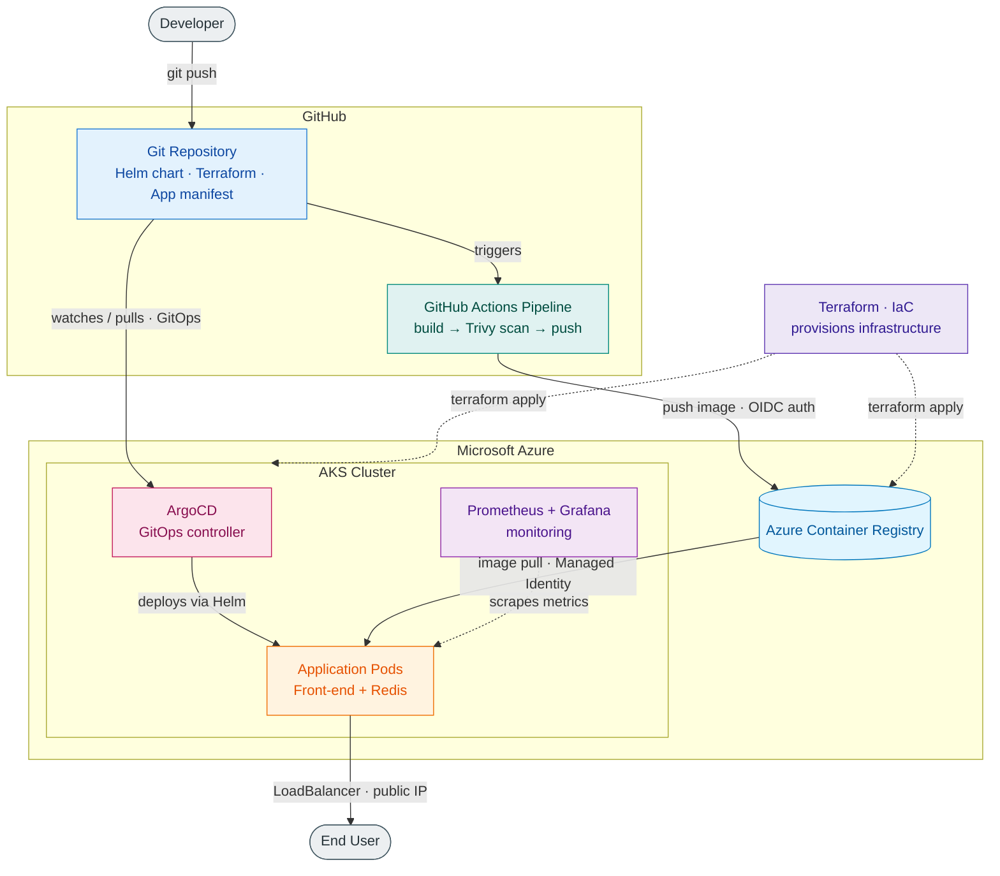

# AKSFlow

> **An end-to-end GitOps pipeline that provisions Azure infrastructure with Terraform, builds and security-scans container images in GitHub Actions, and continuously deploys to AKS via ArgoCD — with full observability through Prometheus and Grafana.**

This project implements a complete DevOps lifecycle for deploying a containerized application to Azure Kubernetes Service (AKS), built entirely on Infrastructure as Code and GitOps principles. The Azure infrastructure — an AKS cluster and a private Azure Container Registry (ACR) — is provisioned declaratively with Terraform, making the entire environment reproducible from code. A CI pipeline in GitHub Actions builds the application's container image, scans it for vulnerabilities with Trivy, and pushes it to the ACR, authenticating to Azure through keyless OIDC federation with no stored secrets. Deployment follows a pull-based GitOps model: ArgoCD, running inside the cluster, continuously watches the Git repository, renders the application's Helm chart, and synchronizes the cluster to match the desired state — with the AKS nodes pulling images from the ACR via a least-privilege Managed Identity. Finally, Prometheus collects cluster and application metrics, which Grafana visualizes as live dashboards, providing observability into the running system.

## Architecture

## Tech Stack

- **Cloud & IaC:** Azure (AKS, ACR, Entra ID), Terraform
- **Containers & Orchestration:** Docker, Kubernetes, Helm
- **CI/CD & GitOps:** GitHub Actions, ArgoCD, OIDC federation
- **Observability & Security:** Prometheus, Grafana, Trivy, Kubescape

## Highlights

- Fully reproducible infrastructure via Terraform with remote state
- Keyless CI/CD authentication using OIDC (no stored secrets)
- Pull-based GitOps deployment with ArgoCD self-healing
- Security scanning (Trivy) integrated as a pipeline gate
- Least-privilege image pulls via Managed Identity